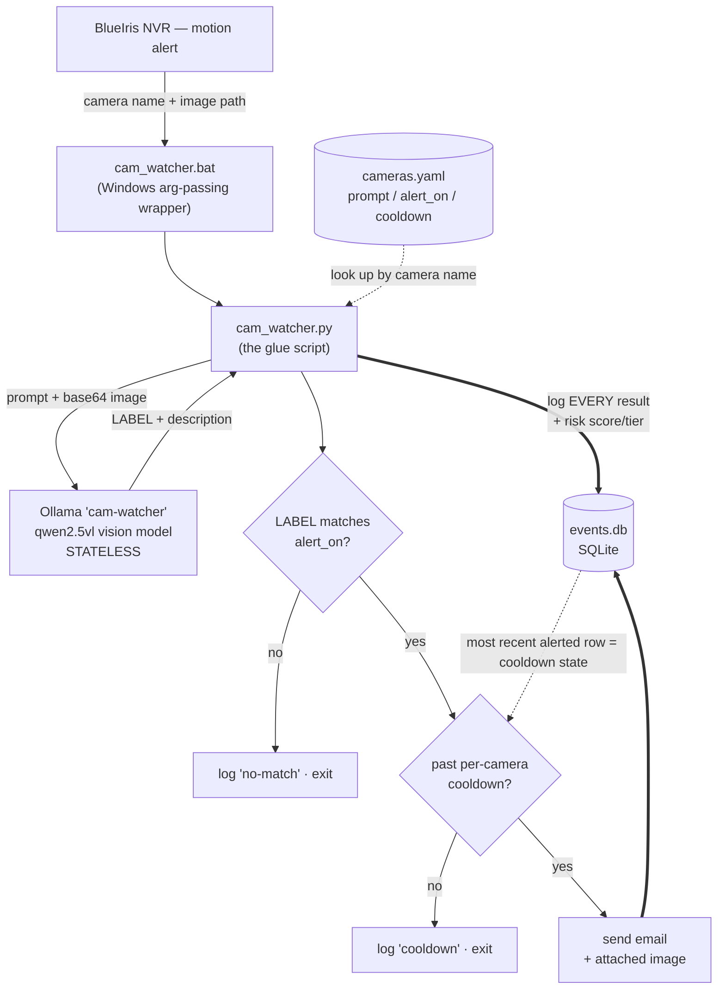

# watch-my-door

[](https://github.com/heathda/watch-my-door/actions/workflows/tests.yml)

BlueIris → Ollama camera alert agent. When BlueIris flags motion on a camera,
this script sends the alert image to a local Ollama vision model, which returns
a per-camera **label** plus a short plain-English **description** of what it
sees. It emails you — with the photo attached and the description in the body —
only when the label is alert-worthy and you're past a per-camera cooldown.
Every result is logged to SQLite for tuning.

**See [`demo/`](demo/)** for what it produces — an example alert email and a
real week of classifications (7,602 frames, 170 emails).

## Architecture

The design splits cleanly along one line: **the model is stateless, the script
is stateful.** Ollama remembers nothing between calls and only ever contributes
a per-frame label + description. *Every* decision that depends on history or must
be reproducible — cooldowns, alert matching, risk scoring — lives in
deterministic Python with SQLite as the single source of truth. That keeps the
alerting logic debuggable and replayable instead of hiding it inside a model
that would answer differently every time.



The whole pipeline is a **single-shot script BlueIris runs once per alert** — no
daemon, no queue, no shared state in memory. State that must survive between
invocations is read back out of `events.db` on the next run.

## Key design decisions

- **Stateless model, stateful script (single source of truth).** Cooldowns are
  derived from the most recent *alerted* row in `events.db` (`last_alert_epoch`),
  not a side file. A *failed* email is logged with `alerted=0`, so it does **not**
  start a cooldown — you won't miss the alert on the next trigger.
- **Nothing may crash out of `main()`.** BlueIris ignores the script's exit code,
  so a crash is silent. Every failure path (no config, missing image, Ollama down,
  bad response, email failure) is logged and returns cleanly.
- **Config-driven, not code-driven.** Adding or tuning a camera is an edit to
  `cameras.yaml` only. The YAML key must exactly match the BlueIris camera name
  (`&CAM`). An unknown camera logs "no config… skipping" and exits harmlessly —
  which lets the BlueIris action be wired globally while only configured cameras
  act.
- **Two-part output contract.** The model returns an UPPER_SNAKE_CASE `LABEL` on
  line 1 and a free-form description after it. `alert_on` is matched against the
  **label only** (substring, case-insensitive), so alerting stays deterministic
  while the description stays human-readable for the email body.
- **Log everything, alert on some.** Every classification — matches, no-matches,
  cooldown suppressions, and errors — is written to `events.db`, including the
  *raw* model output. That builds a tuning dataset and makes history **replayable**
  against new prompts or scoring functions without re-running the vision model.
- **The model is the only filter.** With no upstream object detector, every camera
  prompt must include a "nothing" label (e.g. `NONE`) so routine frames have
  somewhere to land. The custom `cam-watcher` model bakes a terse system prompt and
  `temperature 0.1` into a `Modelfile`; the base must be **vision-capable** (a
  text-only model silently ignores the image).
- **Risk tiering: the score is *derived*, never stored.** A rolling risk score
  (currently shadow mode — logged, not yet acting) turns isolated frames into
  escalation: each event adds label-weight × camera × time-of-day points, and the
  total decays exponentially when things go quiet. There is no running-level
  state anywhere — the score is recomputed from the recent event log on every
  run, the same pattern as the cooldown. The LLM **never** produces the score;
  it would hallucinate non-reproducible numbers. See
  [Risk tiering](#risk-tiering-shadow-mode) below.

### How the model answers

Each camera prompt defines a fixed list of allowed labels (always including a
"nothing" label like `NONE`). The model replies in two parts:

```
LABEL                         <- line 1: matched against the camera's alert_on
A short description of what    <- the rest: goes into the notification email
is happening and why.
```

`cam_watcher` matches `alert_on` against the **label only**, so alerts stay
deterministic even though the description is free-form.

## Risk tiering (shadow mode)

Isolated alerts miss patterns: one person on one camera is routine, but the
same few minutes producing *loitering out front, a person on the driveway, and
a person at the back door* is someone moving around the property. Risk tiering
scores that.

```
score(now) = Σ over recent events:  weight(label) × camera_mult × night_mult
                                    × repeat_dampening^rank
                                    × 0.5 ^ (age / half_life)
```

- **Every event adds points; silence decays them** (half-life ~10 min). Blips
  fade, patterns escalate. Score ranges map to tiers
  (`QUIET / NOTICE / ELEVATED / URGENT`).
- **Pure function of the event log.** The decayed sum is mathematically
  identical to keeping a running level, but with no mutable state to drift or
  corrupt — and it makes history **replayable**. The `risk_*` columns written
  to `events.db` are an audit trail, never read back for decisions.
- **Repeat dampening** (found during calibration, see war stories): the newest
  event of each camera+label counts in full; each older repeat counts half
  again. Distinct signals stack; re-observing one open garage door does not.
- **Night labels are deliberately light.** `AT_NIGHT_PERSON`-style labels get
  LOW base weights and the ×3 night multiplier does the escalating — a daytime
  mislabel stays QUIET, a real 2 a.m. hit lands ELEVATED in one frame.
- All knobs live in `cameras.yaml`: a global `_risk` block (half-life, window,
  dampening, night hours, tier thresholds) + a per-camera `risk` block
  (multiplier, label weights). No `_risk` block = feature off.

Currently **shadow mode**: every event's score/tier is logged alongside it,
but alerting is unchanged while the tiers are validated against reality. Tune
against your own history without re-running the vision model:

```bash
python replay.py                     # tier distribution + top episodes
python replay.py --config alt.yaml   # A/B experimental weights vs. the same history
python replay.py --tier ELEVATED     # list every moment at/above a tier
```

## War stories / lessons learned

The non-obvious issues that come with wiring an LLM into a Windows NVR — some hit
in practice, one headed off by design. The kind of thing that doesn't show up in a
unit test.

- **`&ALERT_PATH` sometimes arrives as a bare filename.** Alerts were logged as
  "image not found" even though BlueIris clearly passed *something*. Depending on
  BlueIris version/settings, the `&ALERT_PATH` macro expands to just a filename
  with no folder. Fix: `resolve_image()` tries the path as given, then falls back
  to `ALERT_IMAGE_DIR / filename`. *Lesson: don't trust an upstream integration's
  string format — degrade gracefully instead of assuming an absolute path.*

- **Service accounts don't share your login's secret store (headed off by
  design).** The Gmail App Password lives in **Windows Credential Manager, which is
  per-user and DPAPI-encrypted**. BlueIris often runs under a *different* account
  (e.g. `LocalSystem`) than the interactive user who'd naturally store the
  credential — so an entry saved under your login would be invisible to the
  service, and email would silently fail. This one was designed around rather than
  gotten burned by: `notify.resolve_password()` documents storing the credential
  under the account BlueIris actually runs as (`psexec -s -i` for `LocalSystem`),
  with a `GMAIL_PASSWORD` env fallback. *Lesson: "works when I run it" and "works as
  a service" are different questions — decide who owns the credential up front.*

- **A raw event sum scores frame count, not activity.** The first risk-scoring
  calibration replayed two weeks of real events and produced 234 URGENT frames —
  every one a household burst. BlueIris re-triggers motion every ~30 s during
  sustained activity, so "sum the recent events" made *one garage door standing
  open* look like twenty distinct signals. The fix wasn't smaller weights, it was
  a different shape: **repeat dampening** (each older repeat of the same
  camera+label counts half again). Same data, re-replayed: 11 URGENT frames, all
  of them genuine multi-camera person sequences. *Lesson: when a score misbehaves,
  ask what it's actually measuring — and replayable logs make the fix a
  five-minute experiment instead of another two weeks of live tuning.*

- **In the dark, the vision model guesses the alarming answer.** The driveway
  gate label worked fine by day, then `GATE_OPEN_NIGHT` started firing almost
  every night — 00:03, 01:35, 04:56 — while the gate sat closed. The tell was in
  the descriptions: identical generic boilerplate ("The gate is open, allowing a
  vehicle to drive through") with zero scene detail. In IR the model can't see
  the latch, and a VLM never says "I can't see" — it picks something, and
  "something" skews dramatic. Fix: an explicit uncertainty default in the prompt
  *and* the system prompt ("if you cannot clearly see the condition, choose the
  normal-state label — never pick the alarming option because you cannot see
  clearly"). *Lesson: for any alert label, define what the model should say when
  the evidence is invisible — otherwise it will hallucinate the interesting case,
  and it will do it every night at 3 a.m.*

- **A hard-coded Python path in the `.bat` silently stopped the alerts.**
  `cam_watcher.bat` pins a full path to `python.exe` (BlueIris runs under a service
  account where `python` isn't on `PATH`). At one point that path was wrong and the
  wrapper stopped launching the script — and because **BlueIris ignores the exit
  code**, nothing surfaced the failure; the household's alerting just quietly went
  dark until it was noticed. (The exact trigger is lost to history — it's a home
  project, not a postmortem culture.) The roadmap response is a self-watchdog plus
  Python auto-detection. *Lesson: a fire-and-forget integration needs a dead-man's
  switch — silent success and silent failure look identical from the outside.*

## Files

| File | Purpose |
|---|---|
| `cam_watcher.py` | Main glue. BlueIris calls it per alert. |
| `notify.py` | Email sender (Gmail SMTP_SSL) with image attachment. |
| `db.py` | SQLite event log; cooldown state derived from it. |
| `risk.py` | Deterministic risk scoring (pure functions over the event log). |
| `replay.py` | Re-score history under any config — the risk tuning tool. |
| `review.py` | CLI view over `events.db` (recent events, label counts). |
| `cameras.yaml` | Per-camera prompt / `alert_on` / cooldown / risk weights. **Add a camera here, not in code.** |
| `Modelfile` | Builds the `cam-watcher` Ollama model (terse, low-temp). |
| `cam_watcher.bat` | BlueIris wrapper (Windows arg-passing workaround). |
| `.env` | Secrets + endpoints (copy from `.env.example`). |
| `events.db` | Auto-created SQLite log (gitignored). |

## Setup

### 1. On the Ollama box (`your-ollama-host`)

Two things are required before anything works:

```bash
# (a) Make Ollama reachable from other machines (it binds to 127.0.0.1 by
#     default). On systemd: add  Environment="OLLAMA_HOST=0.0.0.0"  then:
sudo systemctl restart ollama
#     ...and ensure the box's firewall allows TCP 11434.

# (b) Pull the vision model and build the custom cam-watcher model.
ollama pull qwen2.5vl:7b
ollama create cam-watcher -f Modelfile     # run from this repo dir
```

Verify from the Windows box: `curl http://your-ollama-host:11434/api/tags`
should list your models.

> Note: `llama3.2:3b` is **text-only** and cannot see images. The model must be
> vision-capable (`qwen2.5vl`, `llava`, `llama3.2-vision`, `moondream`, ...).

### 2. On the BlueIris (Windows) box

```powershell
pip install -r requirements.txt
copy .env.example .env                 # then edit .env
copy cameras.yaml.example cameras.yaml # then edit for your cameras
copy cam_watcher.bat.example cam_watcher.bat # then edit for python path

```

`cameras.yaml` is gitignored (it holds your camera names/layout); the repo ships
`cameras.yaml.example` as a starting point. See
[Adding / tuning a camera](#adding--tuning-a-camera) for the format.

Edit `.env`:
- `GMAIL_USER` — your Gmail address.
- `GMAIL_PASSWORD` — a 16-char **App Password** (Google Account → Security → App
  passwords), not your normal password. **Prefer storing this in Windows
  Credential Manager instead of plaintext** (see below) and leaving this blank.
- `NOTIFY_EMAIL` — where alerts go. One address, or several separated by commas.

**Password via Windows Credential Manager (recommended):** instead of putting the
App Password in `.env`, store it in the OS vault. Run this **as the account
BlueIris runs under** (Task Manager → Details → `BlueIris.exe` → User name; if
it's `LocalSystem`, store it via `psexec -s -i`):

```powershell
pip install keyring
# Use `python -m keyring`, not bare `keyring` -- the console script often isn't
# on PATH even though the package is installed. (Try `py -m keyring` if `python`
# isn't recognized.)
python -m keyring set watch-my-door youraddress@gmail.com   # paste the App Password

# Verify it stored and is readable by THIS account:
python -m keyring get watch-my-door youraddress@gmail.com
```

`notify.py` reads Credential Manager first (entry name = `KEYRING_SERVICE`,
default `watch-my-door`; username = `GMAIL_USER`) and only falls back to
`GMAIL_PASSWORD` if nothing is stored. Credential Manager entries are per-user
and DPAPI-encrypted, so they must be created under the same account that runs
the script.
- `OLLAMA_URL` — enter URL/IP of the box hosting your Ollama LLM.
- `ALERT_IMAGE_DIR` — BlueIris's alert-image folder (e.g. `C:\BlueIris\Alerts`).
  BlueIris's `&ALERT_PATH` often arrives as a bare filename; the script resolves
  it against this folder. Find it via `ollama`-side search or BlueIris →
  Settings → Folders.
- `OLLAMA_KEEP_ALIVE` — how long Ollama keeps the model warm in GPU memory after
  an alert (default `30m`). See **Performance** below.

### Performance / latency

Loading the ~8 GB model into the GPU takes ~7s, so in theory an alert that hits a
cold (unloaded) model pays that reload on top of inference. Two knobs are meant to
help:

- **`OLLAMA_KEEP_ALIVE`** tells Ollama how long to keep the model resident after a
  request — the intent being that sparse motion alerts don't each trigger a reload.
  `30m` is the default here; `-1` keeps it warm *forever* (holds the VRAM
  permanently and blocks other large models from loading alongside it); the box's
  own idle default may be just seconds, which this per-request value overrides.
  **In practice, tuning this didn't meaningfully change per-alert latency in my
  setup** — end-to-end time was acceptable either way, so the root cause was never
  chased down. Treat it as a reasonable knob to try, not a proven fix.
- **GPU vs CPU** — run `ollama ps` on the box; you want `100% GPU`. If it shows
  CPU offload, the model doesn't fit in VRAM (free some by removing unused
  models) — that's when latency really hurts. Fully on GPU, the alert-image
  resolution costs only a second or two, so don't shrink it.

### 3. BlueIris configuration

Configured per camera (the script looks up behavior by camera name). All of the
relevant settings live on the **Alerts** tab — *not* the Motion/Trigger tab. The
`&ALERT_PATH` macro is populated by the alert pipeline, so the action must be an
**alert** action, not a trigger action.

1. **Camera Properties → Motion/Trigger tab:** just confirm *"Enable motion
   sensor"* is checked. 
2. **Camera Properties → Alerts tab:** check *"Add to the alerts list"* and set
   its dropdown to **"JPEG files"** (not "Database only" — that one stores no
   file on disk, so `&ALERT_PATH` would resolve to nothing).
3. **Camera Properties → Record tab:** adjust the image quality settings for the
   saved alert images as desired.
4. **Camera Properties → Alerts tab → `On alert…` button → Add → "Run a program
   or write to file":**
   - **Program / File:** full path to `cam_watcher.bat` (e.g. `C:\watch-my-door\cam_watcher.bat`)
   - **Parameters:** `"&CAM" "&ALERT_PATH"`

> The BlueIris camera name (what `&CAM` expands to) must **exactly match** a key
> in `cameras.yaml`, including case and hyphens.

## Adding / tuning a camera

Edit `cameras.yaml`. The key must match the BlueIris camera name exactly.

```yaml
Garage:
  prompt: >
    This is a garage door camera. Choose the single best label:
    OPEN (door open), PERSON (someone near the garage),
    CLOSED (door closed, nothing notable), NONE (nothing relevant).
    Then briefly describe what you see.
  alert_on: ["OPEN", "PERSON"]  # matched (substring, case-insensitive) against the LABEL
  notify_cooldown_sec: 1800     # no repeat email within 30 min of an alert
  risk:                         # optional -- feeds the rolling risk score
    multiplier: 1.5             # how much this camera's events matter
    label_weights:              # per-label points (unlisted labels score 0)
      PERSON: 12
      OPEN: 6
```

Always include a non-alert label (e.g. `NONE`/`CLOSED`) in the prompt and leave
it **out** of `alert_on` — that's the routine path for the majority of frames.
Risk scoring's global knobs (half-life, night window, tier thresholds) live in
the `_risk` block at the top of the file — see `cameras.yaml.example`.

## Inspecting the log

```bash
python review.py                 # last 25 events, all cameras
python review.py --counts        # label frequency per camera
sqlite3 events.db "SELECT ts_iso, camera, classification, risk_score, risk_tier, alerted, note FROM events ORDER BY id DESC LIMIT 20;"
```

`alerted=1` rows are what drive cooldowns. Everything is logged (matches,
no-matches, cooldown suppressions, errors — plus each event's risk score/tier)
so prompts, cooldowns, and risk weights can be tuned against real data. See
`replay.py` for re-scoring history under experimental configs.

## Tests

```bash
pip install -r requirements-dev.txt
python -m pytest -q
```

The suite mocks Ollama and email, so it runs offline (no box or credentials
needed). It covers the answer parser, the SQLite logging + cooldown logic, image
path resolution, the risk-scoring math (decay, night window, repeat dampening,
tier boundaries), and the full alert/no-alert/cooldown/failure decision flow —
including that shadow-mode scoring never changes alerting behavior.

`tests/test_config.py` validates the live `cameras.yaml` — notably that every
`alert_on` label and every risk-weighted label actually appears in that camera's
prompt (otherwise it could never fire/score). **Run the suite after editing
`cameras.yaml`.**

## Troubleshooting

- **Nothing happens on alert:** check `cam_watcher.log` in this folder. Confirm
  the camera name in BlueIris matches a key in `cameras.yaml` exactly.
- **`Ollama request failed`:** the box isn't reachable — re-check step 1(a)
  (binding + firewall).
- **Model ignores the image / weird answers:** you're probably on a text-only
  base model. Rebuild `cam-watcher` from a vision model.
- **No email:** verify the App Password and that `.env` is filled in; failures
  are logged in `cam_watcher.log`.

## License

MIT — see [LICENSE](LICENSE).
