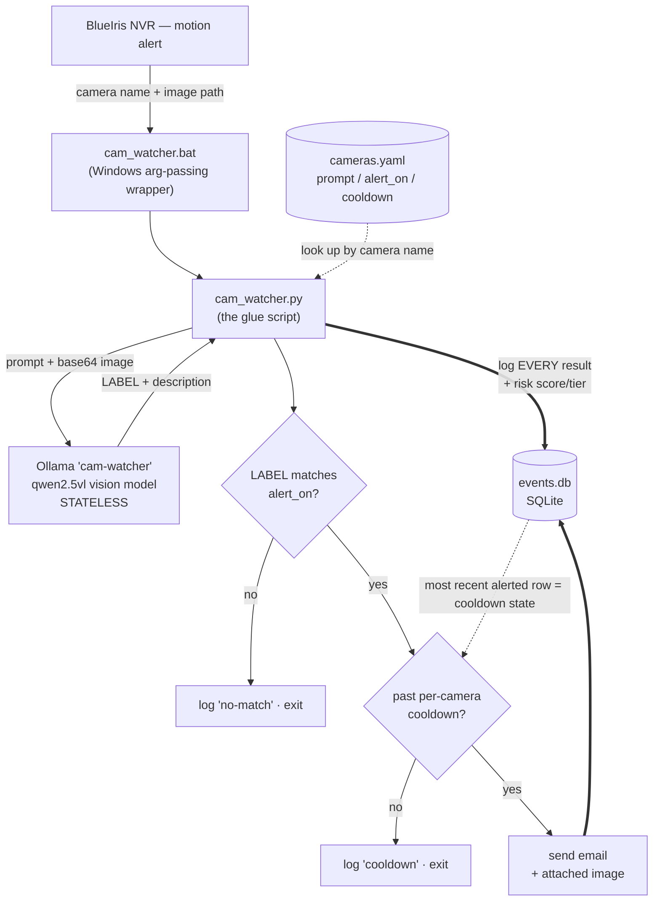

# watch-my-door

[](https://github.com/heathda/watch-my-door/actions/workflows/tests.yml)

BlueIris → Ollama camera alert agent. When BlueIris flags motion on a camera,
this script sends the alert image to a local Ollama vision model, which returns
a per-camera **label** plus a short plain-English **description** of what it
sees. It emails you — with the photo attached and the description in the body —
only when the label is alert-worthy and you're past a per-camera cooldown.
Every result is logged to SQLite for tuning.

**See [`demo/`](demo/)** for what it produces — an example alert email and a
real week of classifications (7,602 frames, 170 emails).

## Architecture

The design splits cleanly along one line: **the model is stateless, the script
is stateful.** Ollama remembers nothing between calls and only ever contributes
a per-frame label + description. *Every* decision that depends on history or must
be reproducible — cooldowns, alert matching, risk scoring — lives in
deterministic Python with SQLite as the single source of truth. That keeps the
alerting logic debuggable and replayable instead of hiding it inside a model
that would answer differently every time.



The whole pipeline is a **single-shot script BlueIris runs once per alert** — no
daemon, no queue, no shared state in memory. State that must survive between
invocations is read back out of `events.db` on the next run.

## Key design decisions

- **Stateless model, stateful script (single source of truth).** Cooldowns are
  derived from the most recent *alerted* row in `events.db` (`last_alert_epoch`),
  not a side file. A *failed* email is logged with `alerted=0`, so it does **not**
  start a cooldown — you won't miss the alert on the next trigger.
- **Nothing may crash out of `main()`.** BlueIris ignores the script's exit code,
  so a crash is silent. Every failure path (no config, missing image, Ollama down,
  bad response, email failure) is logged and returns cleanly.
- **Config-driven, not code-driven.** Adding or tuning a camera is an edit to
  `cameras.yaml` only. The YAML key must exactly match the BlueIris camera name
  (`&CAM`). An unknown camera logs "no config… skipping" and exits harmlessly —
  which lets the BlueIris action be wired globally while only configured cameras
  act.
- **Two-part output contract.** The model returns an UPPER_SNAKE_CASE `LABEL` on
  line 1 and a free-form description after it. `alert_on` is matched against the
  **label only** (substring, case-insensitive), so alerting stays deterministic
  while the description stays human-readable for the email body.
- **Log everything, alert on some.** Every classification — matches, no-matches,
  cooldown suppressions, and errors — is written to `events.db`, including the
  *raw* model output. That builds a tuning dataset and makes history **replayable**
  against new prompts or scoring functions without re-running the vision model.
- **The model is the only filter.** With no upstream object detector, every camera
  prompt must include a "nothing" label (e.g. `NONE`) so routine frames have
  somewhere to land. The custom `cam-watcher` model bakes a terse system prompt and
  `temperature 0.1` into a `Modelfile`; the base must be **vision-capable** (a
  text-only model silently ignores the image).
- **Derived state, not stored state.** Both the cooldown and the risk score are
  recomputed from the event log rather than kept in a running variable — nothing
  to drift, nothing to corrupt, and history stays replayable. The LLM never
  produces the score; it would hallucinate non-reproducible numbers. See
  [Risk tiering](#risk-tiering-shadow-mode).

### How the model answers

Each camera prompt defines a fixed list of allowed labels (always including a
"nothing" label like `NONE`). The model replies in two parts:

```
LABEL                         <- line 1: matched against the camera's alert_on
A short description of what    <- the rest: goes into the notification email
is happening and why.
```

`cam_watcher` matches `alert_on` against the **label only**, so alerts stay
deterministic even though the description is free-form.

## Risk tiering (shadow mode)

One person on one camera is routine. The same few minutes producing *loitering
out front, a person on the driveway, and a person at the back door* is someone
moving around the property. A rolling score turns isolated frames into that
pattern: every event adds `label weight × camera × night` points, and the total
decays exponentially when things go quiet (half-life ~10 min), mapping to
`QUIET / NOTICE / ELEVATED / URGENT`.

It is **derived, never stored** — recomputed from the recent event log on every
run, so there is no state to drift and history stays replayable. Currently
**shadow mode**: the score and tier are logged beside each event, alerting is
unchanged. Knobs live in `cameras.yaml` (`_risk` globally, `risk` per camera).

→ **[DESIGN-NOTES.md](DESIGN-NOTES.md#risk-tiering)** for the formula, repeat
dampening, and why the LLM never produces the score.

```bash
python replay.py                     # tier distribution + top episodes
python replay.py --config alt.yaml   # A/B experimental weights vs. the same history
python replay.py --tier ELEVATED     # list every moment at/above a tier
```

`replay.py` tunes **weights** by re-scoring labels already in the log. It is
structurally blind to a **prompt** change, which alters which labels get
produced at all — that needs the original frames and a second pass through the
model, which is `ab_prompt.py`:

```bash
# same frames, two prompts, diff the labels (run where the JPEGs live)
python ab_prompt.py --a cameras-baseline.yaml --b cameras.yaml --camera driveway-cam --limit 40
python ab_prompt.py --b cameras.yaml --stored-as-a --camera driveway-cam   # half the model calls
```

## Watchdog: knowing the pipeline died

A system whose normal output is silence cannot tell you it stopped — two
production outages passed unnoticed. `watchdog.py` runs from Task Scheduler
every 5 minutes and checks staleness, error ratio, Ollama reachability, and
disk. Two findings shaped it:

- **"No events" would have caught neither outage.** BlueIris kept firing and the
  script kept logging — 931 rows in one day, every one an error. The
  **error-ratio** check is what catches a dead model.
- **A fixed silence threshold cannot work.** The p99 gap between events swings
  **~30×** across the day, so the threshold is learned per hour-of-day from the
  log itself.

It notifies on confirmed state change, and reads `events.db` read-only — a
sidecar, never in the alert path.

→ **[DESIGN-NOTES.md](DESIGN-NOTES.md#watchdog-knowing-the-pipeline-died)** for
the threshold learning and the replay that sized the notification rate.

```bash
python watchdog.py --dry-run    # print the health report, never email
python watchdog.py --force      # email it regardless of state (test the wiring)
```

## Lessons learned

The non-obvious ways this project has broken — in production, in the tuning
tools, and once caught just before shipping — each written up with what it cost
and what generalizes → **[WAR-STORIES.md](WAR-STORIES.md)**.

- Don't trust an upstream integration's string format — `&ALERT_PATH` is
  sometimes a bare filename.
- "Works when I run it" and "works as a service" are different questions —
  decide who owns the credential up front.
- When a score misbehaves, ask what it is *actually* measuring. A raw event sum
  scored frame count, not activity: 234 URGENT frames, every one a household burst.
- Define what the model should say when the evidence is invisible, or it will
  invent the interesting case — nightly, at 3 a.m.
- A new label that overlaps a scene you already see will break the label it
  overlaps, and no rewording fixes it. Five versions, five failures, one dog-walker.
- When your failure mode and your success mode write the same row, add the
  column that tells them apart.
- An A/B that samples a stochastic model once per item measures the sampler as
  much as the change. Two prompts were rejected on disagreement rates that sat
  *below* the live config's disagreement with itself.
- A fire-and-forget integration needs a dead-man's switch — silent success and
  silent failure look identical from the outside.
- When a model is unreliable at *describing* something, don't assume it is
  unreliable at *deciding* about it. A vehicle-identity check that asked for
  colour and body type and compared them in code was measurably worse than one
  that just asked "is this ours?" — same model, same frames, and its
  descriptions stayed wrong while its verdicts were right.
- A capability can be missing from a fifteen-label prompt and present in a
  one-question prompt. If a rule inside a big prompt never seems to run, try
  asking it on its own before rewording it a seventh time.
- A verification step that can itself fail is worse than none — and strictly
  worse when it runs *after* the irreversible part.
- When the error message keeps changing as you fix things, you are walking down
  a resource ceiling, not fixing separate bugs. Find the input dimension that
  scales the cost — here, image pixels — before tuning the knobs it names.
- A model upgrade can be better at the task and still break the contract,
  because the *response shape* changed. A reasoning model returned HTTP 200 with
  an empty `content` and its answer in `thinking`; every label came back blank
  and nothing alerted.
- On a single-GPU box the diagnostic *is* a deployment. Correlate a
  "pre-existing" bug's start time against your own first command before
  believing it.
- A change that removes false alarms must be scored against a test that can only
  pass if the real alarm still fires. One that fixed every false alarm on the
  driveway camera drove genuine-stranger detection to **0/8** — caught only by a
  corpus that lies to the model about which cars are the household's.
- Before tuning what the model says about a scene, establish what the camera can
  see. A label that had emailed 19 times was named for an event that camera
  physically cannot observe; the fix was one line of alerting config, not a
  seventh prompt rewrite.
- Probe an isolated question twice, worded to lean opposite ways. If the answer
  follows your emphasis rather than the image, the capability isn't there and no
  second call will rescue it.
- When a model reports something impossible, check the input before debugging the
  reasoning. Half of one camera's vehicle alerts came from frames whose lower
  two-thirds had been replaced by flat green — and the model described a vehicle
  parked exactly where the picture ended.

## Files

| File | Purpose |
|---|---|
| `cam_watcher.py` | Main glue. BlueIris calls it per alert. |
| `notify.py` | Email sender (Gmail SMTP_SSL) with image attachment. |
| `db.py` | SQLite event log; cooldown state derived from it. |
| `risk.py` | Deterministic risk scoring (pure functions over the event log). |
| `replay.py` | Re-score history under any config — the **weight** tuning tool. |
| `ab_prompt.py` | Run two configs over the same stored frames and diff the labels — the **prompt** tuning tool. `--frames-file` scores a hand-adjudicated corpus for accuracy rather than agreement. |
| `vehicle_id.py` | Second-call vehicle identity check. The single-call prompt would not perform the known/unknown comparison at all, so when a frame gets a vehicle label the identity question is asked on its own. Off unless a camera sets `vehicle_check`. |
| `watchdog.py` | Scheduled health check: is anything arriving, is it classifying, is Ollama up, is the disk full. |
| `review.py` | CLI view over `events.db` (recent events, label counts, unrecognized labels). |
| `labels.py` | Derives each camera's permitted labels from its own prompt, so a label the model invented can be flagged instead of silently dropped. |
| `cameras.yaml` | Per-camera prompt / `alert_on` / cooldown / risk weights / watchdog thresholds. **Add a camera here, not in code.** |
| `Modelfile` | Builds the `cam-watcher` Ollama model (terse, low-temp). |
| `cam_watcher.bat` | BlueIris wrapper (Windows arg-passing workaround). |
| `watchdog.bat` | Task Scheduler wrapper for the watchdog (every 5 min). |
| `.env` | Secrets + endpoints (copy from `.env.example`). |
| `events.db` | Auto-created SQLite log (gitignored). |
| [`WAR-STORIES.md`](WAR-STORIES.md) | What went wrong in production, and what generalizes. |
| [`DESIGN-NOTES.md`](DESIGN-NOTES.md) | Long-form reasoning: the risk score, the watchdog's learned thresholds. |

## Setup

### 1. On the Ollama box (`your-ollama-host`)

Two things are required before anything works:

```bash
# (a) Make Ollama reachable from other machines (it binds to 127.0.0.1 by
#     default). On systemd: add  Environment="OLLAMA_HOST=0.0.0.0"  then:
sudo systemctl restart ollama
#     ...and ensure the box's firewall allows TCP 11434.

# (b) Pull the vision model and build the custom cam-watcher model.
ollama pull qwen2.5vl:7b
ollama create cam-watcher -f Modelfile     # run from this repo dir
```

Verify from the Windows box: `curl http://your-ollama-host:11434/api/tags`
should list your models.

> Note: `llama3.2:3b` is **text-only** and cannot see images. The model must be
> vision-capable (`qwen2.5vl`, `llava`, `llama3.2-vision`, `moondream`, ...).

### 2. On the BlueIris (Windows) box

```powershell
pip install -r requirements.txt
copy .env.example .env                 # then edit .env
copy cameras.yaml.example cameras.yaml # then edit for your cameras
copy cam_watcher.bat.example cam_watcher.bat # then edit for python path

```

`cameras.yaml` is gitignored (it holds your camera names/layout); the repo ships
`cameras.yaml.example` as a starting point. See
[Adding / tuning a camera](#adding--tuning-a-camera) for the format.

Edit `.env`:
- `GMAIL_USER` — your Gmail address.
- `GMAIL_PASSWORD` — a 16-char **App Password** (Google Account → Security → App
  passwords), not your normal password. **Prefer storing this in Windows
  Credential Manager instead of plaintext** (see below) and leaving this blank.
- `NOTIFY_EMAIL` — where alerts go. One address, or several separated by commas.

**Password via Windows Credential Manager (recommended):** instead of putting the
App Password in `.env`, store it in the OS vault. Run this **as the account
BlueIris runs under** (Task Manager → Details → `BlueIris.exe` → User name; if
it's `LocalSystem`, store it via `psexec -s -i`):

```powershell
pip install keyring
# Use `python -m keyring`, not bare `keyring` -- the console script often isn't
# on PATH even though the package is installed. (Try `py -m keyring` if `python`
# isn't recognized.)
python -m keyring set watch-my-door youraddress@gmail.com   # paste the App Password

# Verify it stored and is readable by THIS account:
python -m keyring get watch-my-door youraddress@gmail.com
```

`notify.py` reads Credential Manager first (entry name = `KEYRING_SERVICE`,
default `watch-my-door`; username = `GMAIL_USER`) and only falls back to
`GMAIL_PASSWORD` if nothing is stored. Credential Manager entries are per-user
and DPAPI-encrypted, so they must be created under the same account that runs
the script.
- `OLLAMA_URL` — enter URL/IP of the box hosting your Ollama LLM.
- `ALERT_IMAGE_DIR` — BlueIris's alert-image folder (e.g. `C:\BlueIris\Alerts`).
  BlueIris's `&ALERT_PATH` often arrives as a bare filename; the script resolves
  it against this folder. Find it via `ollama`-side search or BlueIris →
  Settings → Folders.
- `OLLAMA_KEEP_ALIVE` — how long Ollama keeps the model warm in GPU memory after
  an alert (default `30m`).
- `OLLAMA_NUM_CTX` — context window sent with every request (default `8192`).
  Ollama's own default is 4096, which is smaller than a single 4 MP alert frame
  (~4,700 vision tokens) and hard-400s the call. This **overrides** any
  `PARAMETER num_ctx` baked into the model, so it must be set correctly here.
- `MAX_IMAGE_EDGE` — longest edge, in pixels, of the image *sent to the model*
  (default `1600`; `0` disables). Only the copy Ollama sees is resized — the
  stored frame and the emailed attachment stay full resolution.

**On latency:** run `ollama ps` and confirm `100% GPU`. If it shows CPU offload,
the model doesn't fit in VRAM and that is where the time goes — free some by
removing unused models. Weights are only half the budget, though: the vision
encoder needs room *beside* them for the image, and that scales with pixels. On
an 8 GB card a 4 MP frame costs ~4,700 tokens, ~45 s a call, and OOMs when two
cameras trigger at once — `MAX_IMAGE_EDGE=1600` roughly halves both.
→ [WAR-STORIES.md](WAR-STORIES.md#one-undersized-gpu-three-different-error-messages) → [DESIGN-NOTES.md](DESIGN-NOTES.md#latency-and-the-keep-alive-knob)
on why `OLLAMA_KEEP_ALIVE` is a knob to try rather than a proven fix.

### 3. BlueIris configuration

Configured per camera (the script looks up behavior by camera name). All of the
relevant settings live on the **Alerts** tab — *not* the Motion/Trigger tab. The
`&ALERT_PATH` macro is populated by the alert pipeline, so the action must be an
**alert** action, not a trigger action.

1. **Camera Properties → Motion/Trigger tab:** just confirm *"Enable motion
   sensor"* is checked. 
2. **Camera Properties → Alerts tab:** check *"Add to the alerts list"* and set
   its dropdown to **"JPEG files"** (not "Database only" — that one stores no
   file on disk, so `&ALERT_PATH` would resolve to nothing).
3. **Camera Properties → Record tab:** adjust the image quality settings for the
   saved alert images as desired.
4. **Camera Properties → Alerts tab → `On alert…` button → Add → "Run a program
   or write to file":**
   - **Program / File:** full path to `cam_watcher.bat` (e.g. `C:\watch-my-door\cam_watcher.bat`)
   - **Parameters:** `"&CAM" "&ALERT_PATH"`

> The BlueIris camera name (what `&CAM` expands to) must **exactly match** a key
> in `cameras.yaml`, including case and hyphens.

## Adding / tuning a camera

Edit `cameras.yaml`. The key must match the BlueIris camera name exactly.

```yaml
Garage:
  prompt: >
    This is a garage door camera. Choose the single best label:
    OPEN (door open), PERSON (someone near the garage),
    CLOSED (door closed, nothing notable), NONE (nothing relevant).
    Then briefly describe what you see.
  alert_on: ["OPEN", "PERSON"]  # matched (substring, case-insensitive) against the LABEL
  notify_cooldown_sec: 1800     # no repeat email within 30 min of an alert
  risk:                         # optional -- feeds the rolling risk score
    multiplier: 1.5             # how much this camera's events matter
    label_weights:              # per-label points (unlisted labels score 0)
      PERSON: 12
      OPEN: 6
```

Always include a non-alert label (e.g. `NONE`/`CLOSED`) in the prompt and leave
it **out** of `alert_on` — that's the routine path for the majority of frames.
Risk scoring's global knobs (half-life, night window, tier thresholds) live in
the `_risk` block at the top of the file — see `cameras.yaml.example`.

**Measure a prompt change before you ship it.** Reading a prompt does not tell
you what it does; four of five prompt revisions in one session read fine and
made things worse, two of them on alerting paths. The workflow that catches it:

```bash
cp cameras.yaml cameras-v1-YYYYMMDD.yaml         # snapshot the known-good config
$EDITOR cameras.yaml                             # make the change
python -m pytest -q                              # config validation
python ab_prompt.py --a cameras-v1-YYYYMMDD.yaml --b cameras.yaml \
    --camera front-cam --since "..." --limit 0   # same frames, both prompts
```

Then **read only the disagreements — and open the JPEG.** Every verdict reached
from the prompt text or the model's own description alone was later overturned
by looking at the actual frame. A new label goes into the prompt but stays out
of `alert_on` until the A/B shows it behaving. `cameras.yaml.example` opens with
four prompt rules, each one learned from a specific failure in the log.

## Inspecting the log

```bash
python review.py                 # last 25 events, all cameras
python review.py --counts        # label frequency per camera
python review.py --unknown       # labels no prompt defines -- these can never alert
sqlite3 events.db "SELECT ts_iso, camera, classification, risk_score, risk_tier, alerted, note FROM events ORDER BY id DESC LIMIT 20;"
```

`alerted=1` rows are what drive cooldowns. Everything is logged (matches,
no-matches, cooldown suppressions, errors — plus each event's risk score/tier)
so prompts, cooldowns, and risk weights can be tuned against real data. See
`replay.py` for re-scoring history under experimental configs.

## Tests

```bash
pip install -r requirements-dev.txt
python -m pytest -q
```

The suite mocks Ollama and email, so it runs offline (no box or credentials
needed). It covers the answer parser, the SQLite logging + cooldown logic, image
path resolution, the risk-scoring math (decay, night window, repeat dampening,
tier boundaries), and the full alert/no-alert/cooldown/failure decision flow —
including that shadow-mode scoring never changes alerting behavior.

`tests/test_config.py` validates the live `cameras.yaml` — notably that every
`alert_on` label and every risk-weighted label actually appears in that camera's
prompt (otherwise it could never fire/score). **Run the suite after editing
`cameras.yaml`.**

## Troubleshooting

- **Nothing happens on alert:** check `cam_watcher.log` in this folder. Confirm
  the camera name in BlueIris matches a key in `cameras.yaml` exactly.
- **`Ollama request failed`:** the box isn't reachable — re-check step 1(a)
  (binding + firewall).
- **Model ignores the image / weird answers:** you're probably on a text-only
  base model. Rebuild `cam-watcher` from a vision model.
- **No email:** verify the App Password and that `.env` is filled in; failures
  are logged in `cam_watcher.log`.

## License

MIT — see [LICENSE](LICENSE).
