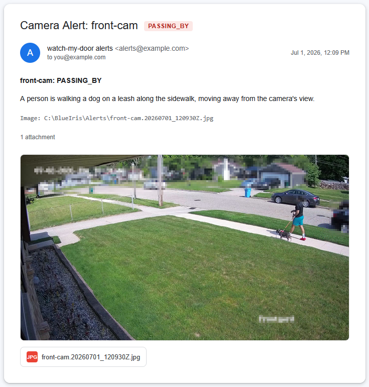

# Demo

What the system actually produces, from a real week of use. Camera names are
anonymized (they map to the generic cameras in
[`cameras.yaml.example`](../cameras.yaml.example)); the numbers are unedited.

## One alert, end to end

BlueIris flags motion → the frame goes to the local vision model → it returns a
`LABEL` plus a one-line description → the script logs it and, if the label is
alert-worthy and the cooldown has elapsed, emails you with the photo attached.
Here's a real one (addresses and paths sanitized):

```
From:    alerts@example.com
To:      you@example.com
Subject: Camera Alert: front-cam - PASSING_BY

front-cam: PASSING_BY

A person is walking a dog on a leash along the sidewalk, moving away from
the camera's view.

Image: C:\BlueIris\Alerts\front-cam.20260701_120930Z.jpg
```

The subject and first body line carry the machine-readable `LABEL`; the sentence
under it is the model's free-form description — the part a human actually reads.



<!-- To show the real thing: censor the alert photo, save it as
     demo/example-alert.png, and add `!demo/example-alert.png` to .gitignore
     (images are ignored globally). Until then GitHub shows a broken image. -->

## A week of classifications (`review.py --counts`)

The vision model is the *only* detector — there's no upstream motion classifier —
so most frames are routine and the system's real job is **saying "nothing" well.**
This is one week: **7,602 classifications, 170 emails.** Everything is logged;
only the alert-worthy, non-cooldown frames notify.

```
$ python review.py --counts

front-cam
   420  NONE
   316  (none)
    56  PASSING_BY  (48 alerted)
     2  LOITERING  (2 alerted)

driveway-cam
  1499  NONE
    61  PERSON  (39 alerted)
    59  (none)
    54  GATE_CLOSED
    42  GATE_OPEN  (11 alerted)
    19  KNOWN_VEHICLE
     1  DELIVERY  (1 alerted)

garage-cam
    60  DOOR_OPEN  (20 alerted)
    37  CLOSED
    14  PERSON  (7 alerted)
     1  NONE

patio-cam
  4638  NONE
   190  (none)
    58  PERSON_AT_DOOR  (26 alerted)
     4  REX  (2 alerted)
     3  ANIMAL  (2 alerted)

utility-cam
    60  PERSON  (12 alerted)
     5  NONE
     1  (none)
```

What the log shows, and why it's logged this way:

- **Signal vs. noise.** `patio-cam` saw 4,638 `NONE` frames and sent 26 emails.
  The whole design goal is that last column staying small while nothing real is
  missed — and you can only tune toward that if you record the 4,638 too.
- **Alert vs. log-only labels.** `driveway-cam` logs `GATE_CLOSED` (54) but never
  emails it — it exists so a *closed* gate has a correct home and stops getting
  mislabeled `GATE_OPEN`. Contrast labels like this are how false positives get
  driven down. `KNOWN_VEHICLE` is similar: recognized, logged, never alerted.
- **`(none)` rows** are frames where the model call failed or returned nothing.
  They're logged (not alerted), so an outage is visible in the data instead of
  silently swallowed.

Regenerate any of this yourself with `python review.py --counts` (or
`python review.py <camera> 50` for a recent per-camera trace).
